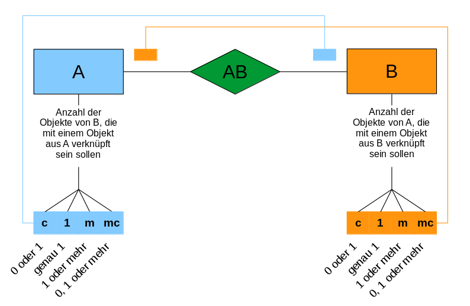

# Datenbankdesign

## Normalformen
In der Regel werden Datenbank nur in die ersten drei Normalformen überführt

### Erste Normalform
Eine Tabelle befindet sich in der 1. Normalform, wenn ihre Attribute nur einfache (atomare) Attributswerte aufweisen

### Zweite Normalform
Eine Tabelle befindet sich in der 2. Normalform, wenn sie in der 1. Normalform ist und jedes Nichtschlüsselattribut voll funktional abhängig vom Primärschlüssel ist.

### Dritte Normalform
Eine Tabelle befindet sich in der 3. Normalform, wenn sie in der 2. Normalform ist und jedes Nichtschlüsselattribut nicht transitiv abhängig vom Primärschlüssel ist.

## Anomalien
Wenn beim Datenbankdesign nicht sichergestellt wird das sich die Datenbank in den drei Normalformen befindet können folgende Anomalien auftreten:
 * Lösch-Anomalie
 * Änderungs-Anomalie
 * Einfügen-Anomalie

## Entity-Relationship-Model
### Grundelemente
 

### Kardinalitäten
 

### Beispiel
