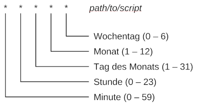

# CLI

#### chmod - Dateirechte ändern
```
chmod [-R] <Rechte> <Datei/Verzeichnis>
```
| Wert | Bedeutung |
| -- | -- |
| 1 | Ausführen (x) |
| 2 | Schreiben (w) |
| 4 | Lesen (r) |

---

#### Cronjob
 
##### Editieren der Cronjobs (für Benutzer *user*)
```
crontab -e [-u <user>]
```

##### Anzeigen der Cronjobs (für Benutzer *user*)
```
crontab -l [-u <user>]
```

---

#### diff
##### Vergleich von zwei Verzeichnissen
```
diff -i -r --brief /path/to/dir1 /path/to/dir2
```

---

#### Mail versand
```
echo "content" | mailx -s "Subject" -r sender@example.com recipient1@example.com[,recipient2@example.com] 
```

---

#### netstat
```
$ netstat <Optionen>
```

|<Optionen>| Erklärung|
| --- | --- |
|``t``| |
|``u``| |
|``l``| |
|``p``| |
|``e``| |
|``n``| numerische Adressen |

---
#### find - Dateien und Verzeichnisse finden
##### Nach Dateien mit dem Namen suchen
```
find [/path/to/directory] -iname [Datei]
```

---
#### PDF-Dateien manipulieren
**benötigtes Paket:** pdftk

##### Zusammenführen
```
pdftk <date1.pdf> <date2.pdf> <date3.pdf>  cat output <ausgabe.pdf>
```

##### Trennen

---
#### screen - Prozesse in den Hintergrund legen
| Befehl | Erklärung |
| -- | -- |
| ``screen`` | Screen starten |
| ``screen -list`` | laufende Screen-Session auflisten |
| ``screen -r <PID>`` | Screen-Session fortsetzen |
| [Strg] + a -> [Strg] + d | Screen-Session in den Hintergrund legen |


