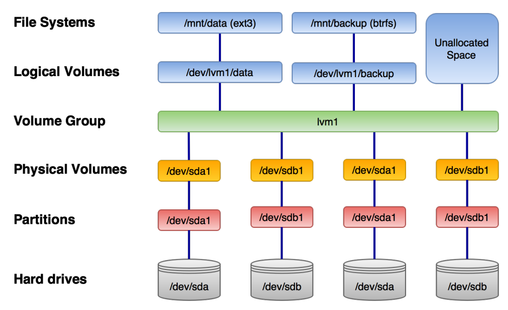

# Logical Volume Manager (LVM)


## Nützliches
### Hinzufuegen einer neuer HDD


### Erweitern einer existierenden Partition
```
# Erweitern der Partition (um 100 GB)
$ lvextend -L +50G /dev/lvm/XXXX

# Resize der Partition
# ReiserFS
$ resize_reiserfs /dev/lvm/XXXX

# alle anderen Dateisysteme
$ resize2fs /dev/lvm/XXXX
```
