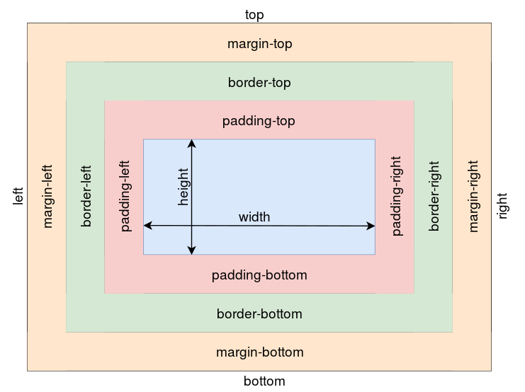
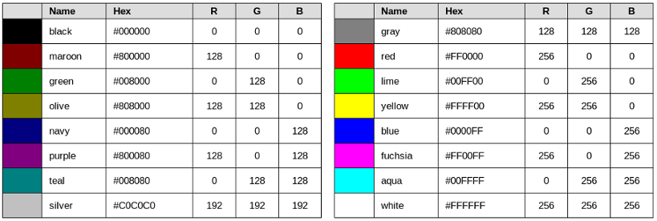

# Cascading Style Sheets
## Box-Modell

## Selektoren (Auswahl)
Eine vollständige Liste kann auf [wikipedia](https://de.wikipedia.org/wiki/Cascading_Style_Sheets#Selektoren) wikipedia gefunden
### einfache Selektoren
| Selector | Beschreibung |
| -- | -- |
| * | Alle Elemente |
| T | Alle Elemente vom Typ T |
| .k | Alle Elemente mit der Klasse k |
| #id | Alle Elemente mit der ID "id" |
| [foo] | Alle Elemente bei denen das foo Attribut gesetzt ist |
| [foo=bar] | Alle Elemente bei denen das foo Attribut den Wert bar hat |

### Kombinatoren
| Selector | Beschreibung |
| -- | -- |
| E F | alle Elemente F, die Nachfahren eines Elements E sind | 
| E > F | alle Elemente F, die ein Kind eines Elements E sind | 
| E ~ F | alle Elemente F, die einen Vorgänger E auf gleicher Ebene haben | 
| E + F |  alle Elemente F, die einen direkten Vorgänger E auf gleicher Ebene haben | 

### Pseudoklassen
| Selector | Beschreibung |
| -- | -- |
| :link | noch nicht besuchte Links | 
| :visit | besuchte Links | 
| :active | das Element das gerade angeklickt wurde | 
| :hover | das Element über dem sich gerade die Maus befindet | 
| :target | das Element, das Ziel des gerade eben angeklickten Verweises ist | 
| :enabled | Elemente in Benutzeroberflächen, die auswählbar sind | 
| :disabled | Elemente in Benutzeroberflächen, die deaktiviert sind | 
| :checked | Elemente von Benutzeroberflächen, die angewählt sind | 
| :not(foo) | Elemente, für die „foo“ nicht zutrifft | 

### strukturelle Pseudoklassen
| Selector | Beschreibung |
| -- | -- |
| :first-child |  Elemente, die das erste Kind ihres Elternelementes sind  | 
| :last-child | Elemente, die das letzte Kind ihres Elternelementes sind  | 
| :nth-child(…) | Elemente, die beispielsweise das n-te Kind ihres Elternelementes sind |
| :nth-last-child(…) | Elemente, die beispielsweise das nt-letzte Kind ihres Elternelementes sind |
| :root | Wurzelelement | 
| :empty | Elemente, die keine Kinder haben | 

### Pseudoelemente
| Selector | Beschreibung |
| -- | -- |
| ::first-line |  erste Zeile des formatierten Textes  |
| ::first-letter | erstes Zeichen des formatierten Textes |
| foo:before | erzeugt ein Element am Anfang des Elements „foo“ (und wählt es aus)  |
| foo:after | erzeugt ein Element am Ende des Elements „foo“ (und wählt es aus)  |

## Grundfarben

